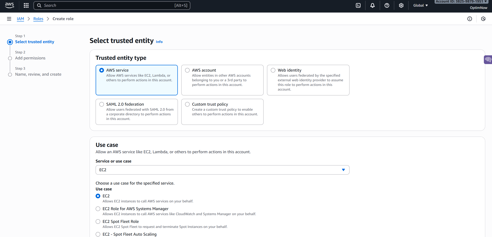
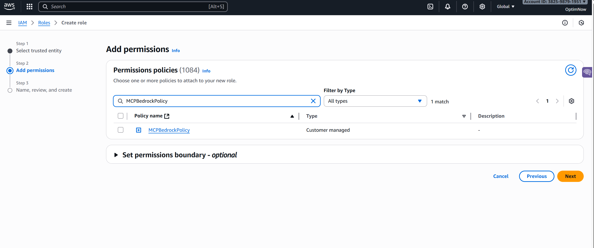
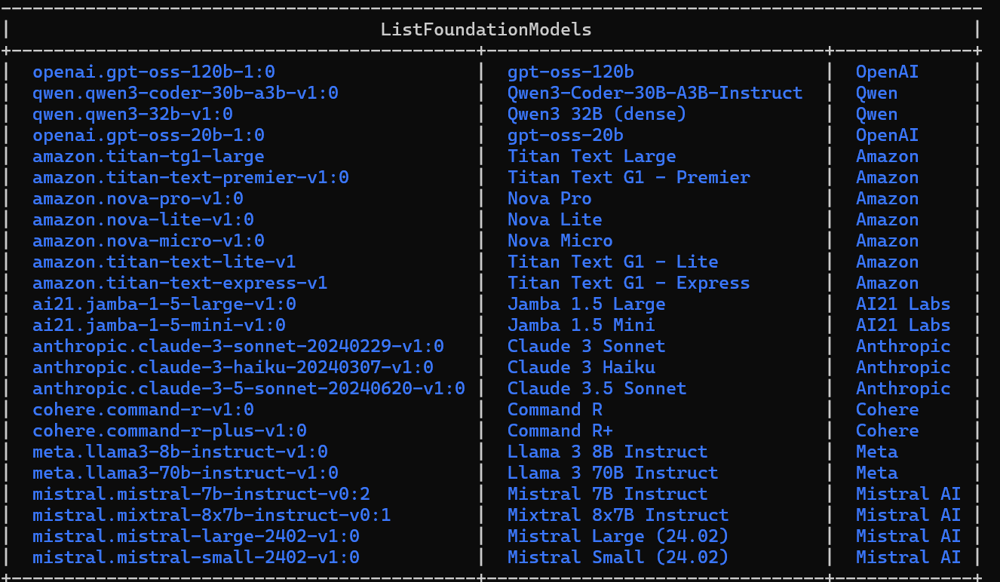
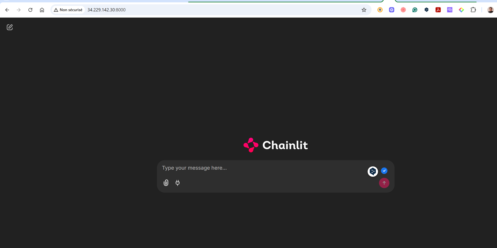
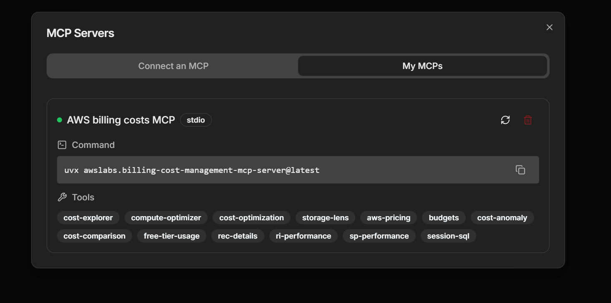

# Tutorial: Deploy a FinOps Chatbot on AWS EC2

## 1. Introduction

### What You'll Build

In this tutorial, you'll deploy an AI-powered FinOps assistant that allows you to analyze AWS costs using natural language. By the end, you'll have:

- A **Chainlit chat interface** running on an EC2 instance
- Integration with **Amazon Bedrock** (using Titan and Claude Sonnet 3.5 models)
- Connection to the **AWS Billing & Cost Management MCP server** for cost analysis
- **Data visualization capabilities** - generate charts, graphs, and diagrams from your cost data
- A working chatbot that can answer questions like:
  - "What were my AWS costs last month?"
  - "Show me EC2 spending trends as a graph"
  - "What are my top 5 cost drivers?"
  - "Create a diagram showing my cost breakdown by service"


### Why This Architecture?

This tutorial uses:

- **EC2 instance**: Provides a self-contained environment where all processing happens within your AWS boundaries - no data leaves your infrastructure
- **Model Context Protocol (MCP)**: Enables the LLM to securely access AWS cost data through standardized tools
- **Amazon Bedrock**: Provides managed access to foundation models (Titan, Claude Sonnet 3.5) without using public LLMs or sending data to third-party services
- **Chainlit**: Offers a ready-to-use chat interface without building a custom UI

**Key security benefit**: Your billing data never leaves AWS. The LLM runs in Bedrock, the MCP server runs locally on EC2, and all cost data stays within your AWS account boundaries: **no data is sent to external services.**

**Extensibility**: You can easily add more MCP servers to extend functionality:
- Additional AWS services (Compute Optimizer, Trusted Advisor, CloudWatch)
- Multi-cloud cost analysis (Azure Cost Management, GCP Billing)
- Custom MCP servers for your specific FinOps workflows


### Prerequisites

Before starting, ensure you have:

- **AWS Account** with billing data available
- **AWS Console access** with permissions to:
  - Launch EC2 instances
  - Create IAM roles and policies
  - Enable Bedrock model access
- **SSH client** installed (Windows: PowerShell or PuTTY, Mac/Linux: built-in terminal)

💡 **Don't worry if you're not familiar with command-line tools** - you can use AI assistants like Claude or ChatGPT to help you navigate Linux commands as you follow this tutorial.


### Time & Cost Estimate

- **Setup time**: 45-90 minutes (depending on your experience level)
- **Monthly cost** (if instance runs 24/7):
  - EC2 t3.small: ~$15-20/month
  - Bedrock API usage: ~$5-10/month (depends on usage)
  - Total: ~$20-30/month

💡 **Cost-saving tip**: Stop the EC2 instance when not in use to reduce costs to ~$5-10/month.

---


## 2. AWS Preparation

This section covers the AWS resources you need to create before launching your EC2 instance. Complete these steps in order.

### Step 2.1: Enable Bedrock Model Access

1. Navigate to the **Amazon Bedrock** console in your chosen region (we'll use **us-east-1** / North Virginia for this tutorial)
2. In the left menu, scroll down to **Model access**
3. Click **Manage model access** or **Request model access**
4. Enable access to:
   - **Amazon Titan** models (Titan Text, Titan Image Generator)
   - **Amazon Nova** models (Nova Pro, Nova Lite, Nova Micro)
5. Click **Save changes** and wait for approval (usually instant)

✅ **Verification**: The status should show "Access granted" for the models you selected.

---

### Step 2.2: Create IAM Policy for MCP & Bedrock

You need a custom IAM policy that grants permissions for Bedrock and AWS cost data access.

1. Download the policy file: [`MCPBedrockPolicy.json`](../MCPBedrockPolicy.json) from the repository root
2. In the **IAM Console**, go to **Policies** → **Create policy**
3. Click the **JSON** tab
4. Copy and paste the content from `MCPBedrockPolicy.json`
5. Click **Next**
6. Name it: **`MCPBedrockPolicy`**
7. Add description: `Permissions for FinOps MCP chatbot to access Bedrock and billing data`
8. Click **Create policy**

**What this policy grants:**
- Bedrock model invocation (InvokeModel, ListFoundationModels)
- Cost Explorer with Billing data access, budgets and price list
- CloudWatch Logs, Compute Optimizer
- List EC2, S3, RDS services

✅ **Verification**: You should see "MCPBedrockPolicy" in your IAM policies list.

---

### Step 2.3: Create IAM Role for EC2

Now create an IAM role that your EC2 instance will use to access AWS services.

1. In the **IAM Console**, go to **Roles** → **Create role**
2. Select **Trusted entity type**: **AWS service**
3. Select **Use case**: **EC2**
4. Click **Next**



5. In **Permissions**, search for and select: **`MCPBedrockPolicy`** (the policy you just created)
6. Click **Next**
7. Name the role: **`MCPBedrockRole`**
8. Add description: `EC2 service role for FinOps MCP chatbot`
9. Click **Create role**



**Why an EC2 service role?**
This allows the EC2 instance to automatically assume this role without storing credentials on the instance. It's more secure than using access keys.

✅ **Verification**: You should see "MCPBedrockRole" in your IAM roles list with "MCPBedrockPolicy" attached.

---

### Step 2.4: Create Security Group

Create a security group to control network access to your EC2 instance.

1. In the **EC2 Console**, go to **Security Groups** → **Create security group**
2. Name: **`MCPBedrockSG`**
3. Description: `Security group for FinOps MCP chatbot`
4. VPC: Select your **default VPC** (or custom VPC if you have one)

**Inbound Rules** - Add two rules:

| Type       | Protocol | Port Range | Source | Description        |
| ---------- | -------- | ---------- | ------ | ------------------ |
| SSH        | TCP      | 22         | My IP  | SSH access         |
| Custom TCP | TCP      | 8000       | My IP  | Chainlit UI access |

**Source IP recommendations:**
- **For testing**: Use "My IP" (your current public IP)
- **For team access**: Use your office IP range (e.g., 203.0.113.0/24)
- **Not recommended**: 0.0.0.0/0 (allows access from anywhere - security risk)

**Outbound Rules**: Leave default (All traffic allowed) - needed for the EC2 instance to reach AWS APIs (Bedrock, Cost Explorer, etc.)

🔒 **Security note**: Port 8000 is needed to access the Chainlit web interface from your browser. Without it, you can only access the UI from within the EC2 instance itself.

✅ **Verification**: You should see "MCPBedrockSG" in your security groups list with the two inbound rules.

---

### Step 2.5: Create or Select SSH Key Pair

You need an SSH key pair to connect to your EC2 instance.

**If you already have a key pair**, you can skip this step and use your existing one.

**To create a new key pair:**

1. In the **EC2 Console**, go to **Key Pairs** → **Create key pair**
2. Name: **`MCPBedrockKP`**
3. Key pair type: **RSA** (better compatibility)
4. Private key file format: **.pem** (for OpenSSH)
5. Click **Create key pair** - the file will download automatically

**Important**: 

- Save the `.pem` file in a secure location
- On Mac/Linux, set proper permissions: `chmod 400 MCPBedrockKP.pem`
- On Windows, Windows will handle permissions automatically

✅ **Verification**: You should have the `.pem` file downloaded and know where it's saved.

---

### Preparation Complete ✅

You've now created:
- ✅ Bedrock model access enabled
- ✅ IAM policy: `MCPBedrockPolicy`
- ✅ IAM role: `MCPBedrockRole`
- ✅ Security group: `MCPBedrockSG`
- ✅ Key pair: `MCPBedrockKP.pem`

Next, you'll use these to launch your EC2 instance.

---


## 3. Launching the EC2 Instance

Now you'll launch an EC2 instance that will host your FinOps chatbot. This instance will run Amazon Linux 2023 and use the IAM role and security group you created earlier.

### Step 3.1: Start the Launch Process

1. In the **EC2 Console**, click **Instances** → **Launch instances**
2. Name your instance: **`FinOps-MCP-Chatbot`**

---

### Step 3.2: Choose AMI and Instance Type

**Application and OS Images (AMI):**
1. Select **Amazon Linux 2023 AMI**
2. Architecture: **64-bit (x86)**
3. Leave the default AMI (usually the top result marked "Free tier eligible")

**Instance type:**
1. Select **t3.small**
   - 2 vCPUs, 2 GiB RAM
   - Cost: ~$0.0208/hour (~$15/month if running 24/7)
   - Sufficient for the Chainlit UI and MCP server

💡 **Can I use t2.micro (free tier)?** No, t2.micro (1 GiB RAM) is too small. The application needs at least 2 GiB RAM to run smoothly.

---

### Step 3.3: Configure Key Pair

**Key pair (login):**
1. Select the key pair you created: **`MCPBedrockKP`** (or your existing key pair)
2. Ensure you have the `.pem` file saved securely

---

### Step 3.4: Configure Network Settings

Click **Edit** next to Network settings:

1. **VPC**: Select your default VPC (or custom VPC if you have one)
2. **Subnet**: Leave as default (or select a public subnet)
3. **Auto-assign public IP**: **Enable** (you need this to access the instance)
4. **Firewall (security groups)**: Select **existing security group**
5. Choose: **`MCPBedrockSG`** (the security group you created earlier)

---

### Step 3.5: Configure Storage

**Configure storage:**
1. Size: **30 GiB** (sufficient for the OS, application, and logs)
2. Volume type: **gp3** (faster and more cost-effective than gp2)
3. Leave other settings as default

💾 **Storage cost**: ~$2.40/month for 30 GiB gp3

---

### Step 3.6: Advanced Details - Attach IAM Role

Scroll down to **Advanced details** and expand it:

1. Find **IAM instance profile**
2. Select: **`MCPBedrockRole`** (the role you created earlier)

⚠️ **Critical**: This step is easy to miss but essential. Without this role, your instance cannot access Bedrock or cost data.

---

### Step 3.7: Review and Launch

Review the **Summary** panel on the right

Verify:
- ✅ Instance type: t3.small
- ✅ Key pair: MCPBedrockKP
- ✅ Security group: MCPBedrockSG
- ✅ IAM role: MCPBedrockRole
- ✅ Storage: 30 GiB gp3

Click **Launch instance**

---

### Step 3.8: Verify Instance is Running

1. Click **View all instances** (or navigate to EC2 → Instances)
2. Wait for the instance state to show: **Running** (takes 1-2 minutes)
3. Wait for the **Status check** to show: **2/2 checks passed** (takes 2-3 minutes)

---

### Step 3.9: Get the Public IP Address

Once the instance is running:

1. Select your instance in the list
2. In the **Details** tab below, find: **Public IPv4 address**
3. Copy this IP address - you'll need it to:
   - SSH into the instance
   - Access the Chainlit UI later

📝 **Example**: `54.123.45.67`

✅ **Verification**: You should see:
- Instance state: **Running**
- Status checks: **2/2 checks passed**
- Public IPv4 address: **Visible and copied** (this IP changes if the instance stops/starts (not using Elastic IP)).

---

### ⚠️ Region Check ⚠️

Before proceeding, confirm your instance is in the same region where you enabled Bedrock:

1. Look at the top-right corner of the AWS Console
2. Verify it shows: **N. Virginia (us-east-1)**

If your instance is in a different region, you'll need to terminate it and launch a new one in us-east-1.

---

### ✅Launch Complete ✅

Your EC2 instance is now running and ready for configuration. You have:

✅ Instance running in us-east-1

✅ Public IP address noted

✅ IAM role attached (MCPBedrockRole)

✅ Security group configured (MCPBedrockSG)

✅ SSH key pair ready (MCPBedrockKP.pem)

**Next**: You'll connect to the instance and install the required software.

---

------

## 4. Preparing the Environment

Now that your EC2 instance is running, you'll connect to it and install the required software.

### Step 4.1: Connect to Your EC2 Instance via SSH

**On Windows (PowerShell):**
```powershell
ssh -i C:\Users\YourName\Downloads\MCPBedrockKP.pem ec2-user@54.160.49.117 <= update with the public IP of the EC2 instance
```

**On Mac/Linux (Terminal):**

```bash
chmod 400 ~/Downloads/MCPBedrockKP.pem
ssh -i ~/Downloads/MCPBedrockKP.pem ec2-user@54.123.45.67
```

Replace:

- `C:\Users\YourName\Downloads\MCPBedrockKP.pem` with your actual key pair filename and path
- `54.123.45.67` with your instance's **Public IPv4 address** (from Step 3.9)

**First-time connection:** You'll see a message like "Are you sure you want to continue connecting?" - type `yes` and press Enter.

✅ **Verification**: You should see a prompt like:

```
[ec2-user@ip-172-31-12-34 ~]$
```

------

### Step 4.2: Update the System

Update Amazon Linux to the latest packages:

```bash
sudo dnf update -y
```

This command:

- `sudo` - runs with administrator privileges
- `dnf` - the package manager for Amazon Linux 2023
- `update -y` - updates all packages, `-y` automatically answers "yes"

⏱️ **Time**: can take up to 1-2 minutes

✅ **Verification**: Command completes without errors, you see "Complete!" at the end.

------

### Step 4.3: Install Basic Packages

Install essential tools:

```bash
sudo dnf install -y git python3-pip tmux
```

**What each tool does:**

- **git** - version control (to clone the repository)
- **python3-pip** - Python package installer
- **tmux** - terminal multiplexer (keeps sessions alive if SSH disconnects)

✅ **Verification**: Run `git --version` - you should see git version 2.x.x

------

### Step 4.4: Install uv Package Manager

Install **uv**, a fast Python package and project manager:

```bash
curl -LsSf https://astral.sh/uv/install.sh | sh
source ~/.cargo/env
```

**Activate uv in current session:**

```bash
source ~/.cargo/env
```

**Why uv?**

- Much faster than pip (10-100x speed improvement)
- Better dependency resolution
- Built-in virtual environment management
- Recommended by AWS for Python projects

⏱️ **Time**: Takes 30-60 seconds

This makes the `uv` and `uvx` commands available in your current session.

✅ **Verification**: Run `uv --version` - you should see uv version 0.x.x

------

### Step 4.5: Clone the Repository

Clone your FinOps MCP repository:

```bash
git clone https://github.com/OptimNow/finops-mcp-bedrock.git
cd finops-mcp-bedrock
```

✅ **Verification**: Run `ls` - you should see files like `README.md`, `src/`, `.chainlit/`, etc.

------

### Step 4.6: Install Project Dependencies

Use `uv` to install all Python dependencies:

```bash
uv sync --all-groups
```

**What this command does:**

1. Reads `pyproject.toml` to see what dependencies are needed
2. Downloads and installs Python 3.13 if not already available
3. Creates a virtual environment in `.venv/` folder
4. Installs all required packages:
   - Chainlit (UI framework)
   - LangChain & LangGraph (AI agent framework)
   - boto3 (AWS SDK)
   - MCP adapters and CLI tools
5. Installs development tools (optional, with `--all-groups`)

⏱️ **Time**: Takes 1 to 2 minutes (first time only)

💡 **What's a virtual environment?** It's an isolated Python environment for this project only, preventing conflicts with system packages.

✅ **Verification**: You should see "Installed X packages" and no error messages at the end.

------

### Step 4.7: Activate the Virtual Environment

Activate the Python virtual environment:

```bash
source .venv/bin/activate
```

After activation, your prompt will change to:

```
(.venv) [ec2-user@ip-172-31-12-34 finops-mcp-bedrock]$
```

The `(.venv)` prefix indicates the virtual environment is active.

⚠️ **Important**: You need to activate this environment **every time** you start a new SSH session. If you don't see `(.venv)`, run this command again.

✅ **Verification**:

- Your prompt shows `(.venv)` at the start
- Run `which python` - it should show: `/home/ec2-user/finops-mcp-bedrock/.venv/bin/python`

------

### Environment Setup Complete ✅

Your EC2 instance is now ready with:

✅ System packages updated

✅ Git, Python, and tmux installed

✅ uv package manager installed

✅ Repository cloned: `finops-mcp-bedrock`

✅ Dependencies installed in virtual environment

✅ Virtual environment activated

**Next**: You'll configure AWS credentials and test the chatbot.


## 5. Configure and Launch the FinOps Chatbot

Now you'll configure AWS credentials and launch the Chainlit application with the AWS Billing MCP server.

### Step 5.1: Configure AWS Region

Set the AWS region as an environment variable:
```bash
export AWS_REGION=us-east-1
```

**Verify it's set correctly:**

```bash
echo $AWS_REGION
```

Expected output: `us-east-1`

💡 **Why this matters**: This tells the AWS SDK which region to use for Bedrock and billing API calls.

✅ **Verification**: The echo command returns `us-east-1`

------

### Step 5.2: Verify Bedrock Access

Test that your IAM role can access Bedrock models:

```bash
aws bedrock list-foundation-models --region $AWS_REGION
```

**What you should see:**

- A JSON list of available models on-demand (as of October 7th, 2025)
- Includes models like: `amazon.titan-text-express-v1`, `amazon.nova-pro-v1:0`, etc.



**If you see an error:**

- Check that your IAM role (`MCPBedrockRole`) is attached to the EC2 instance
- Verify you enabled Bedrock model access in Section 2.1
- Confirm you're in the us-east-1 region

✅ **Verification**: You see a JSON list with multiple foundation models, no error messages.

------

### Step 5.3: Verify MCP Configuration

Check that the AWS Billing MCP server is configured:

```bash
cat .chainlit/mcp.json
```

**Expected content:** You should see a configuration that includes the AWS Billing MCP server, similar to:

```json
{
  "servers": {
    "aws-billing": {
      "type": "stdio",
      "command": "uvx",
      "args": ["awslabs.billing-cost-management-mcp-server@latest"],
      "env": {
        "AWS_REGION": "us-east-1",
        "AWS_PROFILE": "default"
      }
    }
  }
}
```

**If the file looks different or is missing**, refer to the repository's `.chainlit/mcp.json` example.

✅ **Verification**: The file exists and contains AWS Billing MCP server configuration.

------

### Step 5.4: Ensure You're in the Project Directory

Make sure you're in the correct folder with virtual environment active:

```bash
cd ~/finops-mcp-bedrock
source .venv/bin/activate
```

Your prompt should show:

```
(finops-mcp-bedrock) [ec2-user@ip-172-31-25-147 finops-mcp-bedrock]$
```

✅ **Verification**: Prompt shows `(finops-mcp-bedrock)` and you're in the `finops-mcp-bedrock` directory.

------

### Step 5.5: Launch the Chainlit Application

Start the Chainlit UI server:

```bash
CHAINLIT_MCP_CONFIG=.chainlit/mcp.json chainlit run src/ui/app.py -h 0.0.0.0 -p 8000
```

**Command breakdown:**

- `CHAINLIT_MCP_CONFIG=.chainlit/mcp.json` - tells Chainlit where to find MCP server configuration
- `chainlit run src/ui/app.py` - runs the application
- `-h 0.0.0.0` - listens on all network interfaces (allows access from your laptop)
- `-p 8000` - uses port 8000 (matching your Security Group rule)

**What you should see:**

```
2025-10-07 14:32:10 - Loaded .env file
2025-10-07 14:32:11 - Your app is available at http://0.0.0.0:8000
2025-10-07 14:32:11 - MCP Server 'aws-billing' connected successfully
```

⚠️ **Don't close this terminal** - the application is running in the foreground. You'll open a new browser window to access it.

✅ **Verification**: You see "Your app is available" and "MCP Server connected successfully" messages.

------

### Step 5.6: Access the Chatbot UI in Your Browser

1. Open your web browser (Chrome, Firefox, Safari, etc.)
2. Go to: `http://<EC2-Public-IP>:8000` Replace `<EC2-Public-IP>` with your instance's Public IPv4 address (from Step 3.9) **Example**: `http://54.123.45.67:8000`

**What you should see:**

- A Chainlit chat interface
- A message box where you can type questions
- (Optional) A welcome message from the assistant



**If the browser doesn't connect:**

- ✅ Verify your Security Group has port 8000 open (Section 2.4)
- ✅ Use the **public IP** (not private IP like 172.x.x.x)
- ✅ Make sure `http://` is in the URL (not `https://`)
- ✅ Check the terminal - is Chainlit still running without errors?

✅ **Verification**: The Chainlit chat interface loads in your browser.

------

### Step 5.7: Test the AWS Billing MCP Integration

Now test that the chatbot can access your AWS cost data. Try these queries:

**Test 1 - Basic cost query:**

```
What were my AWS costs last month?
```

**Expected behavior:**

- The assistant uses the AWS Billing MCP tools
- You see tool usage indicators in the chat
- You get actual cost data from your AWS account

**Test 2 - Cost breakdown:**

```
Show me my top 5 AWS services by cost for the last 30 days
```

**Expected behavior:**

- The assistant queries Cost Explorer
- Returns a list or chart of your top services

**Test 3 - Visual representation:**

```
Create a chart showing my daily AWS spending for the last week
```

**Expected behavior:**

- The assistant generates a visualization
- You see a graph or chart embedded in the chat

💡 **No cost data?** If you have a new AWS account with minimal usage, you might not see much data. Try asking about available AWS services or regions instead.

✅ **Verification**: The chatbot responds with actual AWS cost data from your account using the MCP tools.

------

### Step 5.8: Understanding What's Happening

When you ask a cost-related question:

1. **Your query** goes to Chainlit UI
2. **LangGraph agent** analyzes it using Bedrock (Titan or Nova models)
3. **Agent decides** which MCP tools to use
4. **AWS Billing MCP server** queries Cost Explorer API
5. **Results** are processed and returned to you
6. **(Optional)** Visualizations are generated using Vega-Lite or Mermaid

All of this happens **within your AWS environment** - no data leaves your EC2 instance or AWS account.

------

### Stopping the Application

When you're done testing:

1. Go back to the terminal running Chainlit
2. Press `Ctrl+C` to stop the server
3. You'll return to the command prompt

**Want to keep it running?** See Section 7 for how to run it as a background service.

------

### Chatbot Launch Complete ✅

You now have a working FinOps chatbot that can:

- ✅ Access AWS cost data via MCP
- ✅ Generate visualizations and charts
- ✅ Answer natural language questions about your cloud costs
- ✅ Run securely within your AWS environment

**Next**: Configure the AWS Billing MCP server with additional capabilities and explore advanced FinOps scenarios.


------

## 6. Verifying MCP Server Connection

Now that your chatbot is running, let's verify that the AWS Billing MCP server is properly connected and see what tools are available.

### Step 6.1: View Connected MCP Servers

In the Chainlit UI, look for the **plug icon** (🔌) in the bottom-left or top-right corner of the interface.

1. Click the **plug icon**
2. This opens the **MCP Server Settings** panel

**What you should see:**



The panel shows:
- **Connected MCP servers** (should show "aws-billing" or similar)
- **Connection status** (green indicator = connected)
- **Available tools** from each MCP server

✅ **Verification**: You see the AWS Billing MCP server listed as connected with a green/active status.

---


### Step 6.2: Explore Available MCP Tools

In the MCP Server Settings panel, you can see the tools provided by the AWS Billing MCP server. These typically include:

**Cost Analysis Tools:**
- `get_cost_and_usage` - Query AWS costs for specific time periods
- `get_cost_forecast` - Get cost predictions
- `get_dimension_values` - List available services, regions, accounts

**Budget & Savings Tools:**
- `get_savings_plans_coverage` - Check Savings Plans utilization
- `get_reservation_coverage` - Check Reserved Instance coverage
- `get_rightsizing_recommendations` - Get EC2 rightsizing suggestions

**Additional Tools:**
- `get_cost_anomalies` - Detect unusual spending patterns
- Various filtering and grouping capabilities

💡 **What are MCP tools?** These are functions that the LLM can call to interact with AWS


### Step 6.3: Test Tool Availability

To verify the tools are working, try a query that uses multiple tools:

```bash
What were my costs last month, and what's the forecast for next month?
```

**Expected behavior:**
- The agent uses `get_cost_and_usage` for historical data
- Then uses `get_cost_forecast` for predictions
- You see tool usage indicators in the chat
- Results include both actual and forecasted costs

**In the chat interface, you might see:**
- 🔧 Tool indicators showing which MCP tools were called
- Progress messages like "Retrieving cost data..."
- Final response with synthesized information

✅ **Verification**: The chatbot successfully uses multiple MCP tools to answer your query.


### Step 6.4: Understanding the Architecture

Here's what happens when you ask a cost question:

```
User Query 
↓ 
Chainlit UI (port 8000) 
↓ 
LangGraph Agent (on EC2) 
↓ 
Amazon Bedrock (Titan/Nova models) 
↓ 
Decides which MCP tools to use 
↓ 
AWS Billing MCP Server (local on EC2) 
↓ 
AWS Cost Explorer API 
↓ 
Results back through the chain
```

**Key security point**: The MCP server runs **locally on your EC2 instance**. Your billing data never leaves AWS, and the Bedrock models process everything within your AWS environment.


### Troubleshooting MCP Connection Issues

**If you don't see the MCP server connected:**

**Check the terminal** where Chainlit is running:

- Look for ``"MCP Server 'aws-billing' connected successfully"``
- If you see connection errors, the MCP server might not be installed

**Verify uvx is available:**

```bash
  which uvx
```

Should return: `/home/ec2-user/.cargo/bin/uvx`

**Test MCP server manually:**

```bash
   uvx awslabs-cost-explorer-mcp-server
```

This should download and start the MCP server (press Ctrl+C to stop)

**Check `.chainlit/mcp.json`**:

```bash
   cat .chainlit/mcp.json
```

Verify it has the correct configuration for aws-billing

**Restart Chainlit** with debug logging:

```bash
   LOG_LEVEL=DEBUG CHAINLIT_MCP_CONFIG=.chainlit/mcp.json chainlit run src/ui/app.py -h 0.0.0.0 -p 8000
```

Check the logs for MCP connection details

------

### MCP Verification Complete ✅

You've confirmed:

✅ AWS Billing MCP server is connected

✅ MCP tools are available and listed

✅ The agent can successfully use tools to query AWS cost data

✅ Your architecture is secure (all processing within AWS)

**Next**: Set up the application to run as a persistent service using systemd.

------

## 7. Running as a Persistent Service with systemd

Currently, the Chainlit application only runs while you're connected via SSH. If you disconnect or the terminal closes, the application stops. Let's configure it as a systemd service so it:

- **Starts automatically** when the EC2 instance boots
- **Restarts automatically** if it crashes
- **Runs in the background** (no need to keep SSH session open)
- **Can be easily stopped/started/restarted** with simple commands

---

### Step 7.1: Stop the Current Chainlit Process

If Chainlit is still running in your terminal:

1. Go to the terminal running Chainlit
2. Press `Ctrl+C` to stop it
3. Verify it stopped (you should see your command prompt return)

---

### Step 7.2: Create the systemd Service File

Create a new systemd service file:
```bash
sudo nano /etc/systemd/system/finops-chatbot.service
```

**Paste this content into the file:**

```ini
[Unit]
Description=FinOps MCP Chatbot with Chainlit
After=network.target

[Service]
Type=simple
User=ec2-user
WorkingDirectory=/home/ec2-user/finops-mcp-bedrock
Environment="PATH=/home/ec2-user/finops-mcp-bedrock/.venv/bin:/home/ec2-user/.cargo/bin:/usr/local/bin:/usr/bin:/bin"
Environment="AWS_REGION=us-east-1"
Environment="CHAINLIT_MCP_CONFIG=/home/ec2-user/finops-mcp-bedrock/.chainlit/mcp.json"
ExecStart=/home/ec2-user/finops-mcp-bedrock/.venv/bin/chainlit run src/ui/app.py -h 0.0.0.0 -p 8000
Restart=always
RestartSec=10

[Install]
WantedBy=multi-user.target
```

**Understanding the configuration:**

| Section                                 | What it does                                                 |
| --------------------------------------- | ------------------------------------------------------------ |
| `After=network.target`                  | Waits for network to be available before starting            |
| `User=ec2-user`                         | Runs as ec2-user (not root)                                  |
| `WorkingDirectory`                      | Sets the project folder as the current directory             |
| `Environment="PATH=..."`                | Includes .venv/bin and .cargo/bin so uv, uvx, and python are found |
| `Environment="AWS_REGION=..."`          | Sets the AWS region                                          |
| `Environment="CHAINLIT_MCP_CONFIG=..."` | Points to the MCP server configuration                       |
| `ExecStart`                             | The actual command to run                                    |
| `Restart=always`                        | Automatically restart if it crashes                          |
| `RestartSec=10`                         | Wait 10 seconds before restarting                            |


**Save and exit:**

- Press `Ctrl+X`
- Press `Y` to confirm
- Press `Enter` to save

✅ **Verification**: The file is saved at `/etc/systemd/system/finops-chatbot.service`

------

### Step 7.3: Reload systemd and Enable the Service

Tell systemd about the new service:

```bash
sudo systemctl daemon-reload
```

Enable the service to start on boot:

```bash
sudo systemctl enable finops-chatbot.service
```

**Expected output:**

```
Created symlink /etc/systemd/system/multi-user.target.wants/finops-chatbot.service → /etc/systemd/system/finops-chatbot.service
```

✅ **Verification**: You see "Created symlink" message.

------

### Step 7.4: Start the Service

Start the service now:

```bash
sudo systemctl start finops-chatbot.service
```

Wait 5-10 seconds for it to fully start.

✅ **Verification**: No error messages appear.

------

### Step 7.5: Check Service Status

Verify the service is running:

```bash
sudo systemctl status finops-chatbot.service
```

**Expected output:**

```
● finops-chatbot.service - FinOps MCP Chatbot with Chainlit
     Loaded: loaded (/etc/systemd/system/finops-chatbot.service; enabled; preset: disabled)
     Active: active (running) since Tue 2025-10-07 14:32:10 UTC; 5s ago
   Main PID: 12345 (chainlit)
      Tasks: 12 (limit: 4657)
     Memory: 145.2M
        CPU: 2.341s
     CGroup: /system.slice/finops-chatbot.service
             └─12345 /home/ec2-user/finops-mcp-bedrock/.venv/bin/python ...

Oct 07 14:32:10 ip-172-31-12-34 systemd[1]: Started FinOps MCP Chatbot with Chainlit.
Oct 07 14:32:11 ip-172-31-12-34 chainlit[12345]: Your app is available at http://0.0.0.0:8000
Oct 07 14:32:11 ip-172-31-12-34 chainlit[12345]: MCP Server 'aws-billing' connected successfully
```

**Look for:**

✅ `Active: active (running)` in green

✅ "Your app is available at http://0.0.0.0:8000"

✅ "MCP Server 'aws-billing' connected successfully"

Press `q` to exit the status view.

✅ **Verification**: Status shows "active (running)" and no errors.

------

### Step 7.6: Test the Application

Open your browser and go to:

```
http://<EC2-Public-IP>:8000
```

The Chainlit UI should load, and you can ask cost questions just like before.

✅ **Verification**: The chatbot is accessible and responds to queries.

------

### Step 7.7: View Service Logs (Optional)

To see real-time logs from the service:

```bash
sudo journalctl -u finops-chatbot.service -f
```

This shows:

- Application startup messages
- MCP connection status
- Any errors or warnings
- User queries and responses (if logging is enabled)

Press `Ctrl+C` to stop viewing logs.

**To view only recent logs (last 50 lines):**

```bash
sudo journalctl -u finops-chatbot.service -n 50
```

------

#### Managing the Service

**Useful commands:**

| Command                                         | What it does          |
| ----------------------------------------------- | --------------------- |
| `sudo systemctl stop finops-chatbot.service`    | Stop the service      |
| `sudo systemctl start finops-chatbot.service`   | Start the service     |
| `sudo systemctl restart finops-chatbot.service` | Restart the service   |
| `sudo systemctl status finops-chatbot.service`  | Check if it's running |
| `sudo systemctl disable finops-chatbot.service` | Don't start on boot   |
| `sudo systemctl enable finops-chatbot.service`  | Start on boot         |


### Step 7.8: Test Auto-Restart on Reboot

Let's verify the service starts automatically after a reboot:

```bash
sudo reboot
```

**Your SSH session will disconnect.** Wait 2-3 minutes, then:

1. SSH back into the instance
2. Check the service status:

```bash
   sudo systemctl status finops-chatbot.service
```

1. Open the browser to `http://<EC2-Public-IP>:8000`

✅ **Verification**: The service is running and the UI is accessible without any manual start commands.

------

### ✅systemd Configuration Complete 

Your FinOps chatbot is now:

✅ Running as a background service

✅ Starts automatically on instance boot

✅ Restarts automatically if it crashes

✅ Accessible at any time without SSH session

✅ Managed with simple systemctl commands

**Next**: Explore practical FinOps scenarios and advanced queries.

------

